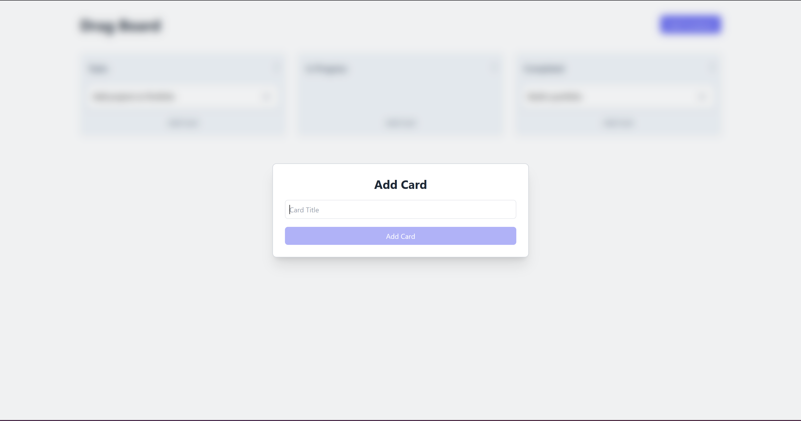
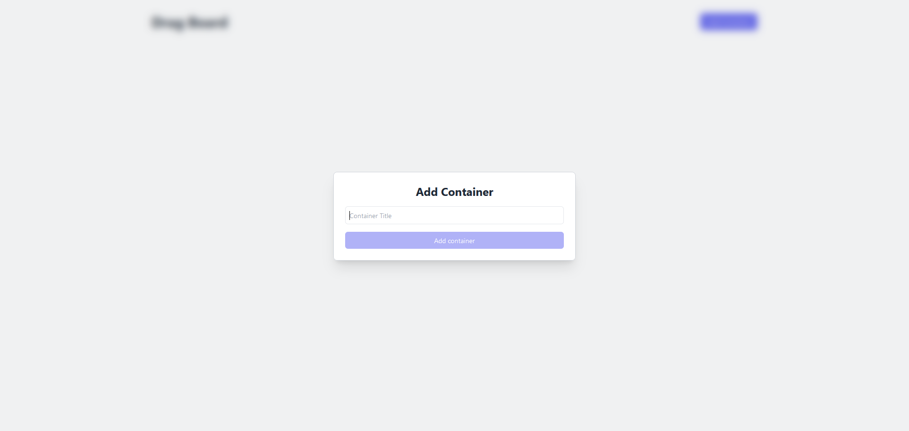
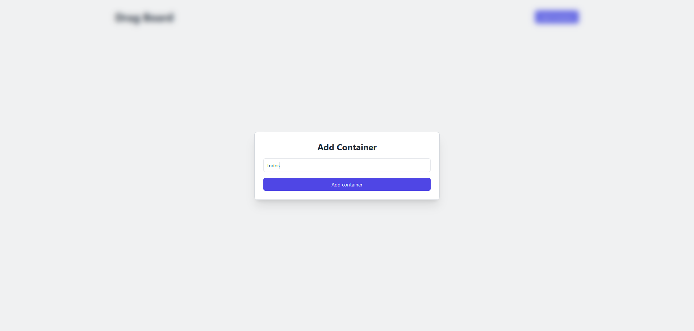
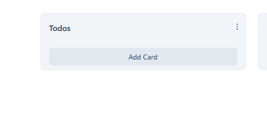
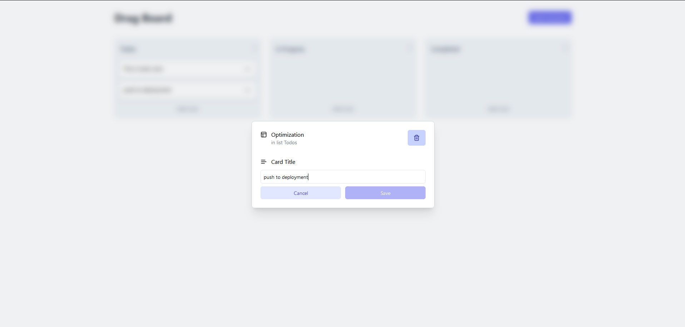
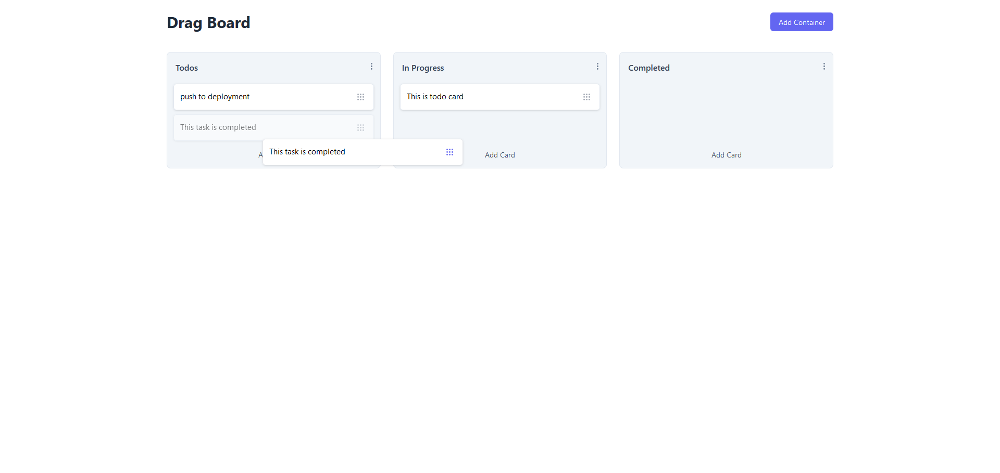

# Drag Board - A Simple Kanban Board for Drag and Drop

**Drag Board** is a lightweight Kanban board that lets you easily drag and drop tasks between columns. It’s built with:

- **React**
- **DnD-Kit**
- **TypeScript**
- **Tailwind CSS**
- **Framer Motion**
- **Lucide Icons**

## 👾 Key Features

- Drag and drop entire containers.
- Delete containers and items with ease.
- Edit the names of containers and individual items.
- Seamlessly move items between containers via drag and drop.
- Add new containers and items (both draggable).
- Visual cues to show which container is currently being edited.

## 📒 Development Process

The development began with implementing the functionality to create containers. Next, I added the drag-and-drop feature for the containers themselves. Following that, I focused on enabling item creation within the containers and allowing those items to be dragged and dropped.

Once the basic functionality was in place, I styled the board, drawing inspiration from modern Kanban boards like Jira, Trello, and Notion, based on my experience.

Next, I introduced features for deleting items and containers and editing their names. I also implemented visual indicators for the container currently being edited. Finally, I made some minor refactoring and styling adjustments.

Throughout the development process, additional features were integrated as needed. All data is saved in local storage, so users can pick up right where they left off when they return.

**Note:** This project serves to demonstrate the use of DnD-Kit and TypeScript. It is not intended to be a fully-featured Kanban board.

## 🚦 Running the Project

To run the project locally, follow these steps:

1. Clone the repository to your local machine.
2. In the project directory, run `npm install` or `yarn` to install the required dependencies.
3. Run `npm start` or `yarn start` to launch the project.
4. Open [http://localhost:5173](http://localhost:5173) (or the address shown in your console) in your web browser to view the app.

## Project Demo 🚀

### Video Demo

### Screenshots

